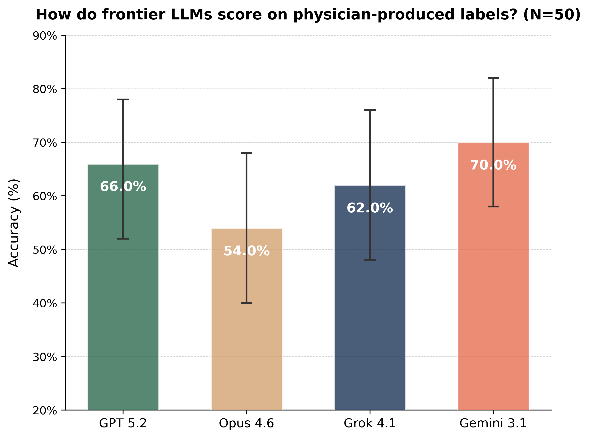
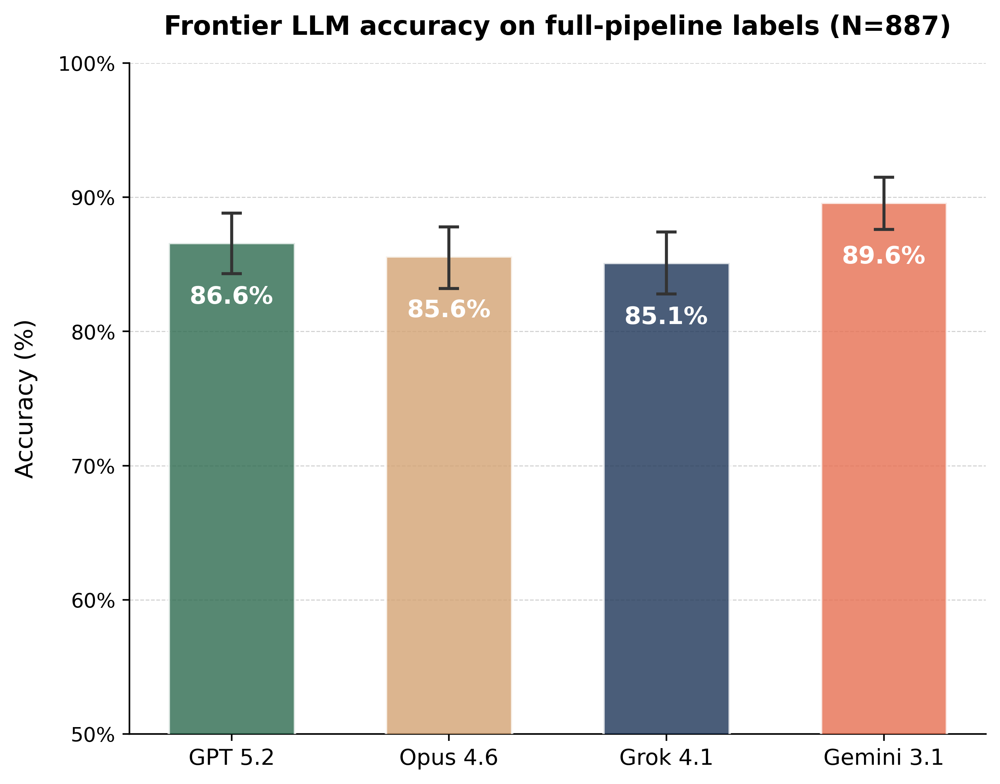

# Improving MedCalc-Bench Labels with Physician Oversight

Code and data from our physicians-in-the-loop curation of new ground truth labels for [MedCalc-Bench](https://openreview.net/forum?id=VXohja0vrQ#discussion), a benchmark (NeurIPS 2024 Oral & included in [MedHELM](https://crfm.stanford.edu/helm/medhelm/latest/#/leaderboard/medcalc_bench)) for evaluating LLMs on medical score computation.

### 💡 Key contributions

- **Hybrid stewardship pipeline**: Agentic LLM verifiers + automated triage concentrate scarce physician attention on the most contentious instances.
- **Physician oversight**: Four board-licensed physicians from three specialties at Stanford Medicine provided annotations and adjudication.
- **Label divergence**: A non-trivial fraction (>25%) of the original MedCalc-Bench v1.0 labels diverge from physician judgment.
- **Corrected labels**: We release a set of better physician-aligned labels as a drop-in replacement for the original benchmark.
- **Downstream impact**: Training on corrected labels yields meaningful performance differences in downstream model alignment via RL (GRPO).

<div align="center">
  <br>
  
  <br>
</div>
<div align="left">
  <sub><b>Figure 1.</b> Answer accuracy of frontier LLMs on 50 MedCalc-Bench v1.0 test instances manually labeled by Stanford physicians. All LLM responses were obtained by API calls between February 20-23, 2026 with <strong>server-side tool use (web search + Python code execution)</strong>, reasoning effort set to "high", and the same system prompt template. Error bars are 95% confidence intervals.</sub>
</div>

<div align="center">
  <br>
  
  <br>
</div>
<div align="left">
  <sub><b>Figure 2.</b> Same evaluation setup as Figure 1, scored against 887 <strong>full-pipeline labels</strong>: the previous 50 physician labels plus 837 labels produced by our stewardship pipeline. Error bars are 95% confidence intervals.</sub>
</div>

## 🚀 Quick evals on our curated labels

For immediate "plug-and-play" evaluation, use
**`data/medcalc_v1_corrected.csv`** and our system prompt template (`data/system_prompt.txt`), which tells the LLM to handle abstention by outputting `N/A` when the patient note lacks sufficient information to answer the question. A user prompt template is also available in the same directory.

The csv file uses the same column schema as the original MedCalc-Bench v1.0, with the exception of the `Row Number` column, which has been renamed to `Unique ID` for clarity. It is designed to be a "drop-in" replacement: if you have an existing evaluation harness for MedCalc-Bench v1.0, you can simply point it to this file to evaluate against our **high-confidence corrected labels**, which were generated by our hybrid physician-oversight system.

**Note:** This corrected dataset includes **887 instances** (a precision-focused subset of the original 1,047). We heavily prioritize precision and only release corrections where our system (validated by physicians) has high confidence. If your evaluation requires the full 1,047 instances, you can can merge this file with the original v1.0 labels (available at `data/phase1/original_test_labels.csv`) using the `Unique ID` column (matches `Row Number` in original) to identify and fill in the missing instances.


## 🗂️ Repository Structure

```
data/
├── tool_use_prompt_template.txt      # Prompt template for tool-using LLMs (web search + code)
├── user_prompt_template.txt          # User template for non-tool-using LLMs
├── system_prompt.txt                 # System prompt template for non-tool-using LLMs
├── medcalc_v1_corrected.csv          # **Recommended**: Final physician-adjudicated labels (v1.0 corrected)
├── phase1/                           # Phase 1: Metadata-informed audit
│   ├── original_test_labels.csv      # Original v1.0 test instances and labels
│   ├── test_audit_pipeline_raw.jsonl # Audits produced by agentic LLM pipeline
│   └── phase1_MD_check/             
│       └── test_spotcheck.xlsx       # Physician spot-check annotations
│
├── phase2/                           # Phase 2: Independent recomputation
│   ├── original_test_labels.csv      # Original v1.0 test instances and labels
│   ├── original_train_labels.csv     # Original v1.0 train instances and labels
│   ├── train_y_new_pipeline_raw.jsonl   # Recomputed labels (train set)
│   └── test_y_new_pipeline_raw.jsonl    # Recomputed labels (test set)
│
├── phase3/                           # Phase 3: Physician validations
│   ├── y_new_and_sampled_MD_evals.xlsx    # Original labels, recomputed labels, and physician labels
│   └── y_final_MD_evals_incorporated.xlsx # Final updated test labels incorporating physician feedback
│
└── RL/                               # Controlled RL experiment data
    ├── train_new_labels.parquet      # Training set with recomputed labels
    ├── train_original_labels.parquet # Training set with original labels
    ├── test_new_labels.parquet       # Test set with recomputed labels
    └── uniform_system_prompt.txt     # System prompt used for RL training

scripts/
├── reproduce_phase3_metrics.py       # Reproduces physician validation metrics
└── run_RL_exp.sh                     # Entry point for controlled RL experiment

verl/                                 # Modified verl framework for RL experiments
```

### 🔬 Reproducing the RL Alignment Experiment

**Hardware requirements:** 8× H100 GPUs or equivalent (80GB each)

**Software requirements:** Install the `verl` framework (0.4.0) with vLLM inference backend as a conda environment. Refer to the [official installation guide](https://verl.readthedocs.io/en/v0.4.0/) for details. The `verl/` directory contains our modified version of the [verl](https://github.com/volcengine/verl) distributed RL training framework. Our key modifications include:
- Custom reward function for MedCalc score matching (`verl/utils/reward_score/medcalc.py`)
- Training configuration files for the RL experiment on Qwen3-8B (`verl/trainer/config_medcalc/`)

```bash
# Assume you have created a conda environment as `verl_venv`.
conda activate verl_venv
chmod +x scripts/run_RL_exp.sh
# Run the controlled RL experiment
./scripts/run_RL_exp.sh
```

The script runs two independent training jobs (combined in one script for convenience):
1. **New-label arm**: Trains with rewards computed against recomputed labels
2. **Original-label arm**: Trains with rewards computed against original labels

Both models are evaluated on the same held-out test set, with accuracy graded against recomputed labels.


## 📋 Dataset Versioning
Our work examines the [MedCalc-Bench dataset](https://github.com/ncbi-nlp/MedCalc-Bench/tree/72748cc0c454ac9d9531494e6180940de03d8470/dataset) released with its 2024 NeurIPS publication (now renamed to "v1.0"), which was the official version available when we ran the LLM pipeline experiments in July–August 2025. A revised ["v1.2"](https://huggingface.co/datasets/ncbi/MedCalc-Bench-v1.2/tree/acb17912657c084f5bf08b8fd029812f84630497) was recently released by the benchmark creators in November 2025. For reproducibility, we include the original v1.0 instances and labels examined in our Phase 1 and Phase 2 studies as `original_test_labels.csv` and `original_train_labels.csv` in the respective data folders. Ongoing revisions by benchmark creators are expected and healthy; our results are intended to motivate transparent and standardized revision methodology, rather than to claim priority over any particular correction.

## 📝 Citation

```bibtex
@misc{scalably2025,
  title         = {Scalable Stewardship of an LLM-Assisted Clinical Benchmark with Physician Oversight},
  author        = {Ye, Junze and Tawfik, Daniel and Goodell, Alex J. and Kotha, Nikhil V. and Buyyounouski, Mark K. and Bayati, Mohsen},
  year          = {2025},
  eprint        = {2512.19691v2},
  archivePrefix = {arXiv},
  primaryClass  = {cs.AI},
  url           = {https://arxiv.org/abs/2512.19691v2}
}
```

## ⚖️ License

See [LICENSE](LICENSE) for details.
